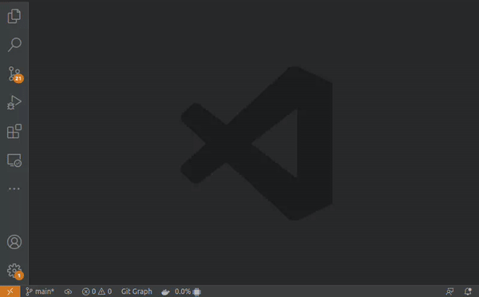

# Docker Stats for VSCode

This extension intents to provide displaying of Docker resources usage in VSCode interface.
Currently, the info are displayed only in a [Statusbar item](https://code.visualstudio.com/api/ux-guidelines/status-bar).
Other displays are planned for future.

## Features

### Docker resource usage Statusbar item

The extension provides a statusbar item which presents the Docker usage of PC
resources, currently supporting CPU % (100% per core) or RAM usage (absolute
and/or percent).

### Selection of statusbar item resources info being displayed

Clicking this statusbar item or launching the command **Docker Stats: Select Info to Display on Status Bar**
in command palette launches a selection of which resources the user wants to be displayed in this statusbar item.

## Requirements

This extension requires Docker to be installed in system. Curently only tests for unix systems were performed

## Extension Settings

Include if your extension adds any VS Code settings through the `contributes.configuration` extension point.

For example:

This extension contributes the following settings:

* `docker-stats.statusBarShowCpu`: Enable/disable showing of CPU percent usage (100% per core) in VSCode statusbar.
* `docker-stats.statusBarShowRamTotal`: Enable/disable showing of RAM absolute usage in VSCode statusbar.
* `docker-stats.statusBarShowRamPercentage`: Enable/disable showing of RAM percent usage in VSCode statusbar.

# Release notes

## 0.1.0

Initial release of Docker Stats for VSCode

Initial features:

- Docker resource usage stats tracking for:
    - CPU core percent usage (100% per core)
    - RAM absolute usage
    - RAM percentage usage
- Statusbar item for showing Docker resource usage
- Command to select the info showed in the statusbar item
- Configurations to set which resources usage info should be displayed on statusbar
